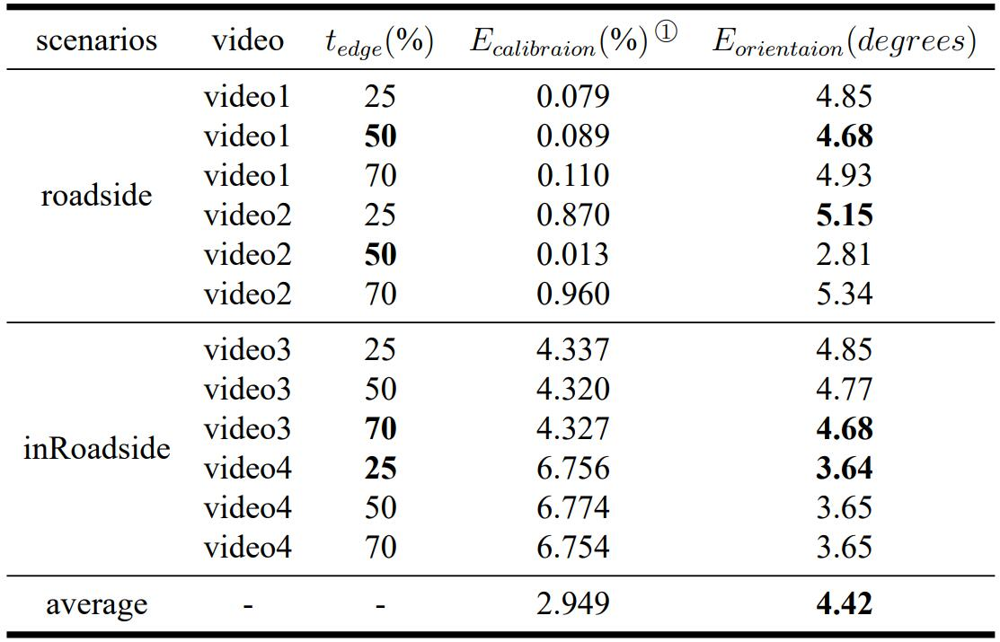

# 车辆方向检测

这是一个基于视频信息的两阶段车辆方向检测算法。

- 基于消失点检测的**相机标定阶段**
- 基于车辆关键点检测与透视变换的**车辆方向检测阶段**

## 项目环境

- python package 见[`requirement.txt`](./requirements.txt)
- torch 1.10.2 + CUDA 10.2
- python 3.7
- [TensorRT 8.2](https://developer.nvidia.com/tensorrt-getting-started)

## 简单使用

- 程序入口 [`app.py`](./app.py)
    - 所有参数
        - `source` (必须) 视频媒体所在路径
        - `engine` (必须) 目标检测网络TensorRT引擎路径
        - `classes` (可选) 目标检测检测种类json文件
        - `roi` (可选) 是否需要选择场景中的ROI区域，默认为False
        - `caliFlag` (必须) True为标定阶段，False为方向检测阶段
        - `calibration` (caliFlag 为False时必须) 标定文件路径
        - `threshold` (可选) 检测车辆强边缘的阈值，默认为0.5
        - `visualize` (可选) 可视化边缘提取过程，默认为False
        - `savePath` (caliFlag 为True时必须) 标定结果保存路径
- 相机标定阶段
  ```shell
  python app.py --source ${video path} --engine ${tensorRT engine} --caliFlag True --savePath ${calibration savePath}
  ```
- 方向检测阶段
  ```shell
  python app.py --source ${video path} --engine ${tensorRT engine} --caliFlag False --calibration ${calibration path}
  ```

## 项目结构

- `detection_model` 车辆方向检测主要模块(标定加检测)
    - `calibration_yolo_model.py` 基于yolov5检测器的相机标定及方向检测模型
    - `calibration_ssd_model.py` 基于SSD检测器的相机标定及方向检测模型
    - `diamondSpace.py` 基于平行坐标系的级联霍夫变换
    - `edgelets.py` 检测车辆横向边缘模块
- `SSD` SSD目标检测网络结构及其推理接口的实现
- `yolov5` 优化后的yolov5 TensorRT推理引擎推理接口的实现
- `results` 实验结果数据
- `test` 实验过程中的一些测试样例及脚本
- `dataset` 实验数据集
- `image` 实验过程中产生的图表及论文中对应的图像
- `app.py` 整体程序开始接口

## 数据集

- 中山大学东校园路侧监控画面
    - 包含四种不同相机位姿及焦距的视频数据
    - 文件结构说明
        - `calibrate` folder 用于对相机进行标定的一段视频数据
        - `eval` folder 用于评估算法对车辆朝向角度检测精确性的一段视频数据

## 程序工作流

### 相机标定

- 基于消失点坐标的相机标定
    - 建立相机模型
      
    - 通过消失点坐标计算相机内参矩阵K与旋转矩阵R(见`detection_model/calibration_utils.py computeCameraCalibration()`)

- 消失点检测
    - 沿道路方向消失点
        1. 通过目标检测网络得到车辆2D框作为ROI区域，检测区域中的Harris角点作为特征点
        2. 对特征点使用**光流法**进行轨迹跟踪得到车辆轨迹集
        3. 将所有轨迹集映射至有限的菱形空间，通过投票算法得到交点最密集处，得到消失点坐标
    - 垂直道路方向消失点
        1. 检测车辆强边缘
        2. 使用与前面一样的方法拟合车辆强边缘得到垂直道路方向消失点

### 车辆方向检测

- 关键点检测
    - 基于一个2D人体姿态估计网络[openpifpaf](https://github.com/openpifpaf/openpifpaf)

    - 我们得到一对包含车辆方向信息的车辆关键点(如车灯、车轮等)
      

- 鸟瞰图转换
    - 我们利用标定阶段得到的鸟瞰图透视矩阵将图像平面映射至对应的鸟瞰图平面
    - 计算关键点连线在鸟瞰图中斜率得到最终方向角度

## 实验结果

根据所提出的误差评估指标，实验在所收集数据上达到的效果如下表所示:

